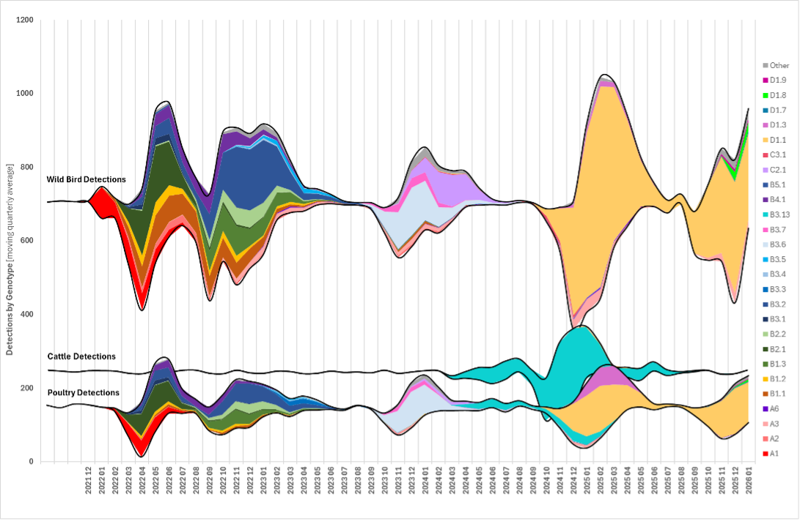

# GenoFLU: Advanced H5N1 Avian Influenza Genotyping Tool

[](https://github.com/USDA-VS/GenoFLU)
[]()
[](https://anaconda.org/bioconda/genoflu)
[]()
[](https://pubmed.ncbi.nlm.nih.gov/37572517/)
[]()

**GenoFLU** is a specialized genotyping tool developed to classify highly pathogenic avian influenza (HPAI) H5N1 goose/Guangdong clade 2.3.4.4b viruses detected in North American flyways. The tool analyzes all eight gene segments to identify both pure Eurasian viruses and those that have reassorted with North American low pathogenic viruses.

<p align="center">
  
</p>

**Figure 1** Genotype distribution of wild bird detections from December 2021 to 7 January 2025 in wild birds with poultry, and B3.13 detections in dairy, overlaid. The dots represent genotypes detected in domestic cats.

## 🌟 Why Use GenoFLU?

- **Comprehensive Genotyping**: Analyzes all eight gene segments for accurate classification
- **High Precision Matching**: Uses a 98% identity threshold to classify segments against reference types
- **Reassortment Detection**: Identifies reassortment events between Eurasian and North American viruses
- **Lineage Tracking**: Maintains genealogical relationships between different genotypes
- **Input**: Accepts FASTA sequence data
- **Transparent Results**: Provides detailed match statistics for each segment
- **Real-time Surveillance**: Supports ongoing monitoring of emerging genotypes
- **Host Species Analysis**: Tracks virus spread across avian and mammalian hosts
- **Comprehensive Output**: Generates both Excel and tab-delimited outputs for easy integration into workflows

## 🔍 Understanding GenoFLU Genotyping

### The GenoFLU Classification System

GenoFLU uses a systematic approach to classify H5N1 viruses:

- **A-type genotypes**: Fully Eurasian viruses, each representing a distinct introduction (A1, A2, etc.)
- **B-type genotypes**: Reassortants of the A1 introduction with North American viruses
- **C-type genotypes**: Reassortants of the A2 introduction with North American viruses
- **D-type genotypes**: Reassortants of the A3 introduction with North American viruses

This system ensures that viruses sharing a common lineage can be logically classified (e.g., B3 genotypes include 13 distinct reassortants, B3.1 to B3.13).

<p align="center">
  
</p>
**Table 1.** Migratory bird GenoFLU genotypes by overall percent, dates of detection, and flyway distribution as of 7 January 2025. Includes detections in wild migratory birds, poultry species and non-dairy mammals; only one sequence per poultry premises was included to represent the premises. <b>NOTE:</b> This table includes only the early representatives of genotype B3.13 first detected in the Central and Pacific flyways <u>prior</u> to the dairy/poultry events.

## 📈 Real-World Applications

### Tracking Avian Influenza Evolution and Spread

GenoFLU has been instrumental in tracking the evolution and spread of H5N1 in North America:

- **December 2021**: First detection of A1 (fully Eurasian) in Newfoundland
- **January 2022**: First detection of reassortant B-type genotypes
- **2022-2024**: Tracking of multiple introductions and reassortment events across all flyways
- **Late 2023-2024**: Identification of B3.13 genotype in dairy cattle, representing a significant host jump
- **Late 2024**: Emergence of D-type genotypes across all four flyways

### Supporting Outbreak Response

GenoFLU enables rapid classification of outbreak isolates, helping to:
- Identify the source of new outbreaks
- Track virus spread between locations
- Monitor reassortment events that may change virus properties
- Guide targeted surveillance strategies

### 🧪 How GenoFLU Works

GenoFLU uses BLAST to compare each segment of your influenza genome against a curated database of reference sequences. Here's how the process works:

1. **Database Creation**: The tool builds a BLAST database from reference sequences where each segment has a specific genotype identifier
2. **Sequence Alignment**: Your input FASTA is aligned against this database using BLAST
3. **Segment Classification**: Each segment is assigned to a reference "type" if it shows ≥98% identity (configurable with `-p` flag)
4. **Genotype Matching**: The genotyping scheme of segment types is compared against a [reference table](./docs/Genotyping_reference_for_US_H5_2.3.4.4b.pdf) of known genotypes
5. **Result Generation**: The tool outputs the genotype if all segments match a known genotyping scheme, or provides detailed information about which segments matched/didn't match

Within the genotyping scheme, each segment has reference "type" sequences assigned unique numbers. A complete genotype is defined by its unique genotyping scheme of all eight segment numbers.

## 📦 Installation

```bash
# Create a conda environment with GenoFLU
conda create -c conda-forge -c bioconda -n genoflu genoflu

# Activate the environment
conda activate genoflu
```

## 🚀 Quick Start

```bash
# Basic usage with a FASTA file
genoflu.py -f <your_genome.fasta>

# Try the test genome
genoflu.py -f test/test-genome-A1.fasta
# Expected output: test-genome-A1 Genotype --> A1: PB2:ea1, PB1:ea1, PA:ea1, HA:ea1, NP:ea1, NA:ea1, MP:ea1, NS:ea1
```

## 📊 Understanding GenoFLU Output

GenoFLU provides comprehensive output in both Excel and tab-delimited formats with six key columns:

1. **Genotype**: The assigned genotype or relevant information if no match is found. Possible values include:
   - A specific genotype (e.g., "A1", "B3.2") when all segments match a known genotyping scheme
   - "Not assigned: No Matching Genotypes" when all 8 segments match reference types, but the genotyping scheme doesn't match any known genotype
   - "Not assigned: Only X segments >98% match found..." when fewer than 8 segments meet the identity threshold

2. **Genotype List Used, >=98%**: List of segments matching established references at or above the threshold (e.g., "PB2:ea1, PB1:ea1, PA:ea1, HA:ea1, NP:ea1, NA:ea1, MP:ea1, NS:ea1")

3. **Genotype Sample Title List**: Top matched reference for each segment (e.g., "ea1:RefA_PB2:PB2, ea1:RefA_PB1:PB1...")

4. **Genotype Percent Match List**: Percentage match to the top match for each segment (e.g., "99.78%, 99.82%...")

5. **Genotype Mismatch List**: Number of mismatches between sample and top match for each segment (e.g., "4, 3, 0, 2...")

The tool also prints a summary line to the console showing the genotype result and segment matches:

```
sample_name Genotype --> A1: PB2:ea1, PB1:ea1, PA:ea1, HA:ea1, NP:ea1, NA:ea1, MP:ea1, NS:ea1 at percent identity at 98.0
```

## 🧬 How GenoFLU Works Internally

GenoFLU processes your input sequences through several key steps:

### 1. Reference Database Creation
The tool creates a BLAST database from the reference sequences located in the dependencies directory:
```bash
cat ${HOME}/git/gitlab/genoflu/dependencies/fastas/*.fasta | makeblastdb -dbtype nucl -out hpai_geno_db
```

### 2. Sequence Alignment and Segment Typing
Your input FASTA is aligned against this database using BLASTN:
```bash
blastn -query input.fasta -db hpai_geno_db -word_size 11 -outfmt "6 qseqid qseq length nident pident mismatch evalue bitscore sacc stitle" -num_alignments 1
```

The tool captures key alignment statistics for each segment:
- Length of alignment
- Number of identical bases
- Percent identity
- Number of mismatches
- E-value and bit score
- Reference segment information

### 3. Genotype Determination
GenoFLU compares the genotyping scheme of segment types against a reference table (genotype_key.xlsx):
- Each segment must match a reference at ≥98% identity (configurable)
- All 8 segments must match a known genotyping scheme for a genotype to be assigned
- If the genotyping scheme is novel, "No Match" is reported

### 4. Result Generation
Results are saved in both Excel (.xlsx) and tab-delimited (.tsv) formats with comprehensive match details for each segment.

## 🧩 Reference Database Structure

GenoFLU relies on a carefully structured reference database:

### FASTA Reference Files
Reference FASTA files must follow a specific header format for the tool to work correctly:
```
>genotype sample gene
```
For example:
```
>ea1 A/goose/Guangdong/1/96 PB2
ATGGAGAGAATAAAAGAACTAAGAGATCTAATGTCGCAGTCTCGCACTCGCGAGATACTGACAAAAACCACAGTGGAC...
```

Where:
- `ea1` is the segment genotype identifier
- `A/goose/Guangdong/1/96` is the sample name
- `PB2` is the gene segment

### Genotype Key File
The [genotype key Excel file](./docs/Genotyping_reference_for_US_H5_2.3.4.4b.pdf) defines known genotypes and their segment genotyping schemes:
- First column: Genotype name (e.g., "A1", "B3.2")
- Subsequent columns: Segment type for each of the 8 segments (PB2, PB1, PA, HA, NP, NA, MP, NS)

For example:
```
Genotype | PB2  | PB1  | PA   | HA   | NP   | NA   | MP   | NS
---------|------|------|------|------|------|------|------|------
A1       | ea1  | ea1  | ea1  | ea1  | ea1  | ea1  | ea1  | ea1
B3.2     | ea1  | am2  | ea1  | ea1  | ea1  | ea1  | am5  | am3
```

This structure allows GenoFLU to accurately match segment genotyping schemes to known genotypes.

## 🌎 Distribution Summary of GenoFLU genotypes

**See Figure 1 above**

Genotype A1 (fully Eurasian [EA]) was first identified in Newfoundland in November 2021 and subsequently wild birds in the Atlantic Flyway collected December 2021. A1 became the predominant unreassorted genotype across all four flyways during 2022, and reassortants of A1 with North American (AM) low pathogenic avian influenza viruses created the ‘B’ genotypes that subsequently predominated during this event. Spillover events into poultry have occurred for all major genotypes except A4, A5, and A6.

The first ‘B’ reassortant genotype was collected in late January 2022, and detection of several other reassortant genotypes have followed, continuing into 2024. The B3.2 genotype is a four gene EA/AM reassortant first detected from samples collected in March 2022 and is the most frequently detected genotype to date in the Americas. By fall of 2022, this genotype had disseminated along flyways into Central and South America, with detections as far south as Antarctica.

Other fully Eurasian genotypes were also introduced into the Atlantic flyway (A2, A5, A6) and the Pacific flyway (A3, A4). Poultry have been affected by genotypes A1, A2, and A3. The A2 genotype was first detected in February 2022 in the northeastern US and persisted in the Atlantic flyway for much of 2022 and early 2023. This genotype was associated with sea bird and marine mammal mortality events in northeastern US. The genotype spread to the Mississippi flyway by the fall of 2023 and re-assorted with North American (AM) wild bird avian influenza viruses including a neuraminidase re-assortment (H5N6), giving rise to the GenoFLU “C” and other minor genotypes. Note: because A2 shows high genetic similarity to the A1 genotype in several segments, only the HA, NA, and PB1 genes have designated references for the A2 genotype in the GenoFLU tool.

Genotype B3.13 likely emerged sometime in the fall of 2023 with only four detections in wild species prior to the detections in cattle (one goose in Colorado, one goose in Wyoming, one raptor in California, and one skunk in New Mexico). The earliest of these was November 2023 in the Central flyway (Colorado). In late March 2024, genotype B3.13 was identified in the milk of dairy cattle; the spillover event from avian species to cattle is estimated to have occurred sometime between late 2023 to early 2024. After the detection of B3.13 in dairy cattle, secondary spread among dairy farms continues, and virus from the dairies has affected peridomestic wildlife, domestic cats, and domestic poultry. Genotype B3.13 is shown in Figure 1, and only the early wild representatives shown in Table 1; the dairy event with spillover to poultry has not been associated with migratory wild birds

New reassortants of GenoFLU A3 predominated the late fall/winter of 2024 denoted as “D” genotypes in Figure 1 and Table 1. Genotype D1.1 has been identified most frequently and across all four flyways, following recent the trajectory of A3 which had previously been limited to the Pacific flyway. The D1.1 genotype has affected poultry and spilled over into mammals.

## 🤝 Support and Citation

For support, please open an [issue on GitHub](https://github.com/USDA-VS/GenoFLU/issues) or [email directly](mailto:tod.p.stuber@usda.gov).

If you use GenoFLU in your research, please [cite our article](https://pubmed.ncbi.nlm.nih.gov/37572517/).